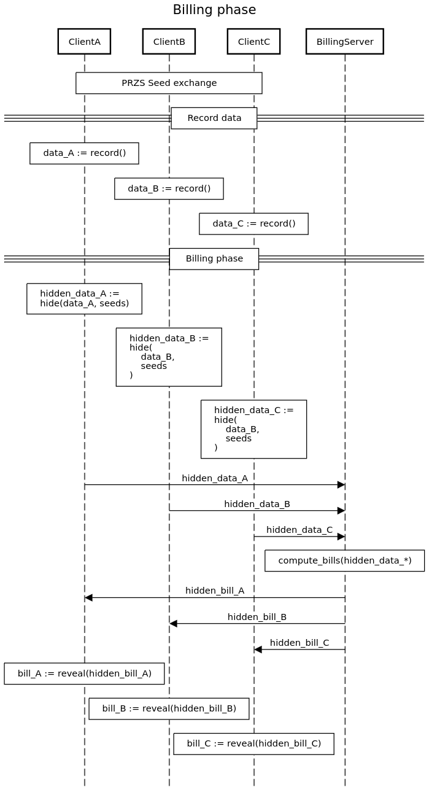

# Billing Protocol
The private billing protocol consists of three phases:
- subscribing to the network,
- setting up PRZS
- executing billing

We briefly discuss each phase.

## Subscription phase
This implementation distinguishes between `edge` and `core` servers.
The role of an `edge` server is to acts as a "gateway" to the peer-to-peer network, and take care of the billing; `core` servers participate in the peer-to-peer network on behalf of the household they represent.
Upon registring with the gateway, a peer receives the identities of all previously registered peers.
The peer is then expected to contact each of these peers: the peers must know each other to achieve [proper PRZS for data hiding](./protocol.md).

The below diagram illustrates the messages sent during a subscription phase with three peers.

## Seed Exchange phase
The PRZS implementation used in this project requires each pair of peers needs to exchange RNG seeds to properly synchronize the generators.
The below diagram illustrates the message exchange during this phase.

Note that the `hello` messages and `seed` messages follow a similiar pattern. As such, the `hello` and `seed` messages can be clubbed.

## Billing phase
With PRZS set up, the peer can start to consume/produce energy and submit their consumption/production data for billing.
Once data is received from all peers, the billing server combines all data and executes the billing procedure.
Once completed, each peer is sent their respective bill.

The message exchange is illustrated in the following diagram.

